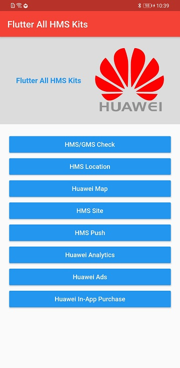
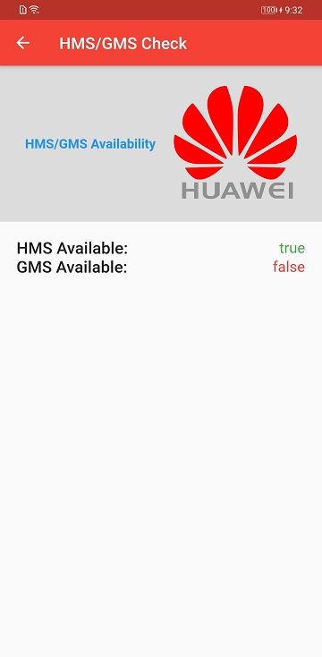
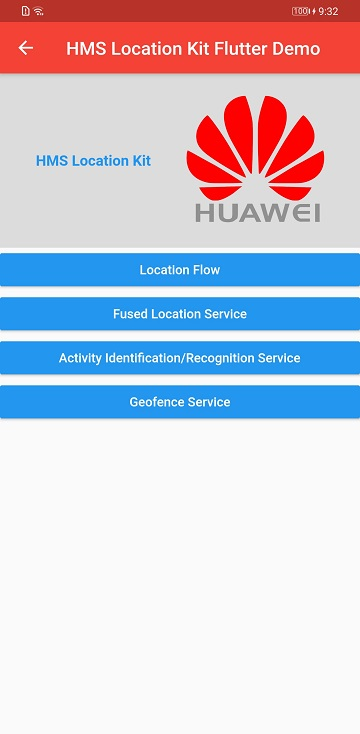
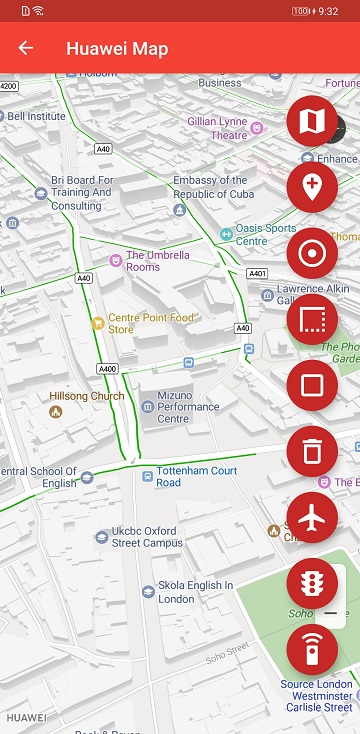
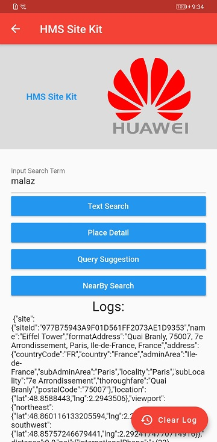
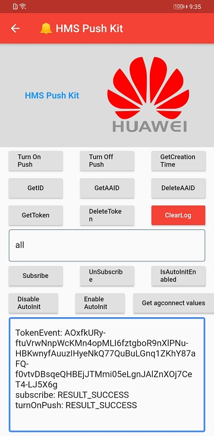
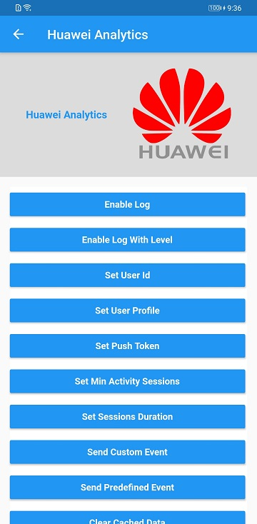
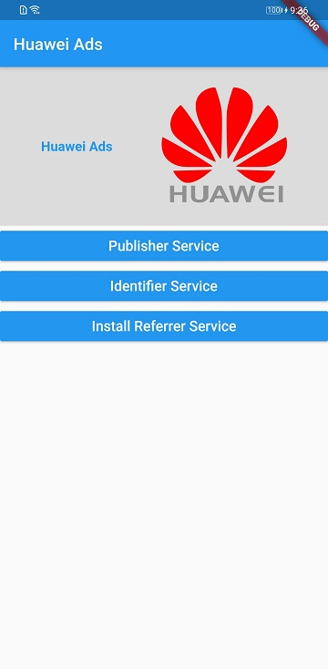
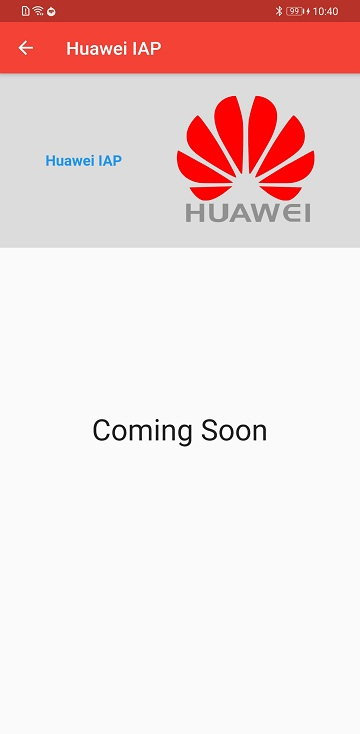

# Flutter All HMS Kits

In this repository we try to combine all **HMS Flutter Kits** in one Project!

Flutter HMS packages integrated in this project :

1.  **HMS / GMS Availability Checker.**

2.  **HMS Location Kit.**

3.  **Huawei Map.**

4.  **HMS Push Kit.**

5.  **Huawei Analytics Kit.**

6.  **Huawei Account Kit.**

7.  **HMS Site Kit.**

8.  **Huawei Ads Kit.**

9.  **HMS In App Purchase Kit.** (Coming Soon)

## Download APK

For testing of Flutter project, please [download](https://github.com/salmanyaqoob/Flutter-All-HMS-Kits/raw/master/apks/flutter-all-hms-release.apk) the apk file.

## Screenshots

### Application

### Screenshots

  

  

  

## Project Guide

### How to create custom platform-specific code

Please read the following documents to make bridge between flutter and custom platform-specific code:

1.  [https://forums.developer.huawei.com/forumPortal/en/topicview?tid=0201275958264540108&fid=0101187876626530001](https://forums.developer.huawei.com/forumPortal/en/topicview?tid=0201275958264540108&fid=0101187876626530001)

2.  [https://medium.com/huawei-developers/flutter-check-hms-gms-availability-10f06aeea387](https://medium.com/huawei-developers/flutter-check-hms-gms-availability-10f06aeea387)

### Install plugins to Project

    huawei_location:
      path: ./hms_packages/huawei_location
    huawei_map:
      path: ./hms_packages/huawei_map
    huawei_site:
      path: ./hms_packages/huawei_site
    huawei_push:
      path: ./hms_packages/huawei_push
    huawei_analytics:
      path: ./hms_packages/huawei_analytics
    huawei_ads:
      path: ./hms_packages/huawei_ads

### Enabling/Disabling the Debug Mode for Analytics

    adb shell setprop debug.huawei.hms.analytics.app <YOUR-PACKAGE-NAME>
    shell setprop debug.huawei.hms.analytics.app .none.

## Official HMS Resources

### HMS All Plugins:

[https://developer.huawei.com/consumer/en/doc/overview/HMS-Core-Plugin](https://developer.huawei.com/consumer/en/doc/overview/HMS-Core-Plugin)

### Huawei Map Kit:

#### Codelab:

[https://developer.huawei.com/consumer/en/codelab/HMSMapKit/index.html#0](https://developer.huawei.com/consumer/en/codelab/HMSMapKit/index.html#0)

#### Document:

[https://developer.huawei.com/consumer/en/doc/development/HMS-Plugin-Guides/introduction-0000001050296908](https://developer.huawei.com/consumer/en/doc/development/HMS-Plugin-Guides/introduction-0000001050296908)

#### Sample Code:

[https://developer.huawei.com/consumer/en/doc/development/HMS-Plugin-Examples/flutter-sample-code-0000001050296766](https://developer.huawei.com/consumer/en/doc/development/HMS-Plugin-Examples/flutter-sample-code-0000001050296766)

#### Flutter Plugin:

[https://developer.huawei.com/consumer/en/doc/development/HMS-Plugin-Library/flutter-sdk-download-0000001050190693](https://developer.huawei.com/consumer/en/doc/development/HMS-Plugin-Library/flutter-sdk-download-0000001050190693)

### Huawei Location Kit:

#### Codelab:

[https://developer.huawei.com/consumer/en/codelab/HMSLocationKit/index.html#0](https://developer.huawei.com/consumer/en/codelab/HMSLocationKit/index.html#0)

#### Document:

[https://developer.huawei.com/consumer/en/doc/development/HMS-Plugin-Guides/introduction-0000001050191280](https://developer.huawei.com/consumer/en/doc/development/HMS-Plugin-Guides/introduction-0000001050191280)

#### Sample Code:

[https://developer.huawei.com/consumer/en/doc/development/HMS-Plugin-Examples/cordova-sample-code-0000001050142431](https://developer.huawei.com/consumer/en/doc/development/HMS-Plugin-Examples/cordova-sample-code-0000001050142431)

#### Flutter Plugin:

[https://developer.huawei.com/consumer/en/doc/development/HMS-Plugin-Library/flutter-plugin-0000001050304074](https://developer.huawei.com/consumer/en/doc/development/HMS-Plugin-Library/flutter-plugin-0000001050304074)

### Push Kit:

#### Codelab:

[https://developer.huawei.com/consumer/en/codelab/HMSPushKit/index.html#0](https://developer.huawei.com/consumer/en/codelab/HMSPushKit/index.html#0)

#### Document:

[https://developer.huawei.com/consumer/en/doc/development/HMS-Plugin-Guides/introduction-0000001050176002](https://developer.huawei.com/consumer/en/doc/development/HMS-Plugin-Guides/introduction-0000001050176002)

#### Sample Code:

[https://developer.huawei.com/consumer/en/doc/development/HMS-Plugin-Examples/flutter-sample-code-0000001050185943](https://developer.huawei.com/consumer/en/doc/development/HMS-Plugin-Examples/flutter-sample-code-0000001050185943)

#### Flutter Plugin:

[https://developer.huawei.com/consumer/en/doc/development/HMS-Plugin-Library/flutter-sdk-download-0000001050186157](https://developer.huawei.com/consumer/en/doc/development/HMS-Plugin-Library/flutter-sdk-download-0000001050186157)

#### Push Kit Server Side code SDK:

**Supporting Language** (Java, C#, Python, GoLang, PHP, Node.js, Ruby on Rails)

[https://developer.huawei.com/consumer/en/doc/development/HMS-Examples/push-serverjavasdk](https://developer.huawei.com/consumer/en/doc/development/HMS-Examples/push-serverjavasdk)

### Analytics Kit:

#### Codelab:

[https://developer.huawei.com/consumer/en/codelab/HMSAnalyticsKit-ReactNative/index.html#0](https://developer.huawei.com/consumer/en/codelab/HMSAnalyticsKit-ReactNative/index.html#0)

#### Document:

[https://developer.huawei.com/consumer/en/doc/development/HMS-Plugin-Guides/introduction-0000001050169136](https://developer.huawei.com/consumer/en/doc/development/HMS-Plugin-Guides/introduction-0000001050169136)

#### Sample Code:

[https://developer.huawei.com/consumer/en/doc/development/HMS-Plugin-Examples/flutter-sample-code-0000001050274368](https://developer.huawei.com/consumer/en/doc/development/HMS-Plugin-Examples/flutter-sample-code-0000001050274368)

#### Flutter Plugin:

[https://developer.huawei.com/consumer/en/doc/development/HMS-Plugin-Library/flutter-sdk-download-0000001050181641](https://developer.huawei.com/consumer/en/doc/development/HMS-Plugin-Library/flutter-sdk-download-0000001050181641)

### Huawei Ads Kit:

#### Document:

[https://developer.huawei.com/consumer/en/doc/development/HMS-Plugin-Guides/publisher-service-0000001050196431](https://developer.huawei.com/consumer/en/doc/development/HMS-Plugin-Guides/publisher-service-0000001050196431)

#### Sample Code:

[https://developer.huawei.com/consumer/en/doc/development/HMS-Plugin-Examples/flutter-sample-code-0000001050274368](https://developer.huawei.com/consumer/en/doc/development/HMS-Plugin-Examples/flutter-sample-code-0000001050274368)

#### Flutter Plugin:

[https://developer.huawei.com/consumer/en/doc/development/HMS-Plugin-Library/flutter-sdk-download-0000001050181641](https://developer.huawei.com/consumer/en/doc/development/HMS-Plugin-Library/flutter-sdk-download-0000001050181641)

### HMS Site Kit:

#### Document:

[https://developer.huawei.com/consumer/en/doc/development/HMS-Plugin-Guides/introduction-0000001050181259](https://developer.huawei.com/consumer/en/doc/development/HMS-Plugin-Guides/introduction-0000001050181259)

#### Sample Code:

[https://developer.huawei.com/consumer/en/doc/development/HMS-Plugin-Examples/flutter-sample-code-0000001050434639](https://developer.huawei.com/consumer/en/doc/development/HMS-Plugin-Examples/flutter-sample-code-0000001050434639)

#### Flutter Plugin:

[https://developer.huawei.com/consumer/en/doc/development/HMS-Plugin-Library/flutter-sdk-download-0000001050434643](https://developer.huawei.com/consumer/en/doc/development/HMS-Plugin-Library/flutter-sdk-download-0000001050434643)

### Note:

This article and repository will update frequently upon new HMS Kits compatibility with Flutter framework.

### Conclusion

This article and repository will be helpful for developers as a kick-start project. Developers can check the project configuration and code and make similar changes in your Flutter project to quickly get up and running for HMS solution.
